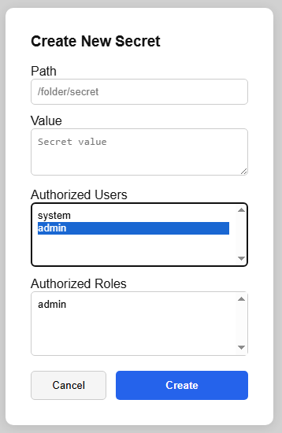

<p align="center">
  
  <h1 align="center">FishyKeys</h1>
  <p align="center">
    <a href="https://github.com/Vidalee/FishyKeys/actions/workflows/test.yaml"></a>
    <a href="https://github.com/Vidalee/FishyKeys/actions/workflows/operator-test.yml"></a>
    <a href="https://github.com/Vidalee/FishyKeys/actions/workflows/operator-test-e2e.yml"></a>
  </p>
</p>

⚠ This project is still a work in progress, which is why there is no installation instructions ⚠

FishyKeys is a secret management system with role-based access control and Shamir’s Secret Sharing for master key management. It provides a web UI and HTTP/gRPC APIs.

Is it quite similar to HashiCorp's Vault but with less features as it's mainly a learning project.

## Features

- Master key management using Shamir’s Secret Sharing
- User and role management
- Fully unit-tested
- Role-based access control for secrets
- Secrets encrypted at rest
- Web user interface for management
- HTTP API for most actions
- gRPC API for secret access
- Kubernetes operator for managing secrets
- Authentication using JWT tokens
- Passwords stored using bcrypt hashing
- Hierarchical secret paths (secrets can be organized in folders)
- Using PostgreSQL for data storage

## Next steps

- Distribute with a Helm chart
- Finish the Kubernetes operator tests
- Do some trivial CRUD endpoints (mainly for roles)
- Optimize DB requests, since we don't use an ORM let's do a few more join tables :)
- Make FishyKeys distributed using Raft protocol

## Example FishySecret CRD config
This will create a `test-secret` Secret with the `DB_USER` and `DB_PASS` keys associated to the corresponding secret paths in the FishySecret backend.
```yaml
apiVersion: fishykeys.2v.pm/v1alpha1
kind: FishySecret
metadata:
  name: test-fishy-secret
  namespace: default
spec:
  target:
    name: test-secret
    namespace: default
  data:
    - secretPath: "/app/db/username"
      secretKeyName: "DB_USER"
    - secretPath: "/app/db/password"
      secretKeyName: "DB_PASS"
```

## Screenshots

Keep in mind frontend was not the main focus of this project, so it is focused on functionality rather than "design".


*Create a master key, shown on first startup.*

---


*Save the shares securely and distributes them to your team.*

---


*Unlock the master key using the shares, this is a collaborative page : you can see others adding their shares live.*

---


*Dashboard showing all the secrets you have access to, with the secret `/cat/key_2` selected.*

---



*Create a secret, you can add metadata and set the access roles.*

---


*Manage roles.*


